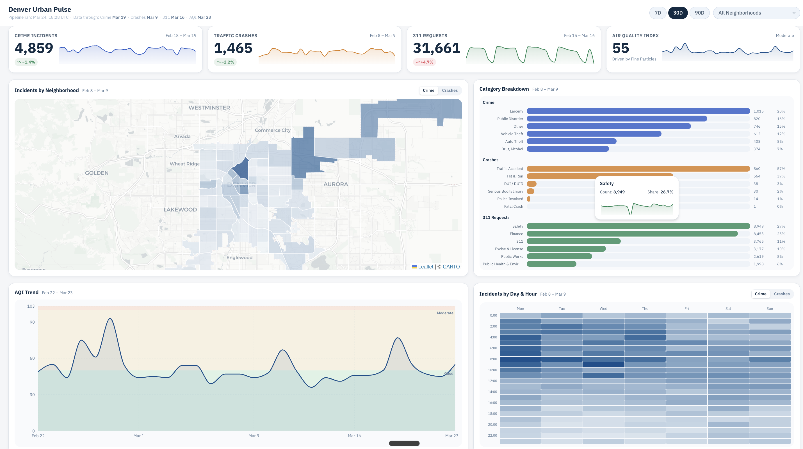

# Denver Urban Pulse

Public BI dashboard built on live Denver open data, refreshed daily. Tracks the city's operational pulse across **crime**, **traffic crashes**, **311 service requests**, and **air quality** — broken down by neighborhood.

**[Live Demo](https://denver-urban-pulse.vercel.app)**



## Features

- **KPI cards** with sparklines, deltas, and per-domain data freshness
- **Interactive choropleth map** — click a neighborhood to filter the entire dashboard
- **Category breakdown** — incident types grouped by domain with trend sparklines
- **Day & hour heatmap** — incident density matrix (day-of-week × hour)
- **AQI trend chart** — multi-pollutant line chart (Ozone, PM2.5, PM10)
- **Neighborhood ranking** — composite score with domain toggle
- **Change leaders** — top 5 improved / worsened neighborhoods by period
- **Global filters** — time window (7d / 30d / 90d) and neighborhood selector
- **Responsive layout** — mobile, tablet, and desktop breakpoints

## Tech Stack

| Layer | Technology |
|-------|------------|
| Frontend | Next.js 16 (App Router), React 19, TypeScript 5.9 |
| Styling | Tailwind CSS 4, shadcn/ui, IBM Plex Sans |
| Charts | Recharts 3 |
| Map | Leaflet + React Leaflet |
| Database | PostgreSQL (Railway) |
| API | Next.js Route Handlers (7 endpoints) |
| Data Pipeline | Python 3.12 daily cron (Railway) |
| Deploy | Vercel (frontend), Railway (DB + pipeline) |
| Testing | Jest 30, React Testing Library |

## Architecture

```
┌─────────────────────────────────────────────────────┐
│                    Data Sources                      │
│  ArcGIS (Crime, Crashes, 311)  ·  AirNow API (AQI)  │
└──────────────────────┬──────────────────────────────┘
                       │  daily cron (06:00 UTC)
                       ▼
┌─────────────────────────────────────────────────────┐
│              Python Pipeline (Railway)               │
│  Migrations → Ingestion → Staging → Marts            │
└──────────────────────┬──────────────────────────────┘
                       │
                       ▼
┌─────────────────────────────────────────────────────┐
│              PostgreSQL (Railway)                     │
│  raw (5 tables) → staging (5) → marts (9)            │
└──────────────────────┬──────────────────────────────┘
                       │
                       ▼
┌─────────────────────────────────────────────────────┐
│          Next.js API Routes (Vercel)                 │
│  /city-pulse/kpis  · /categories · /heatmap          │
│  /category-trends  · /neighborhoods                  │
│  /environment/aqi  · /environment/comparison          │
└──────────────────────┬──────────────────────────────┘
                       │
                       ▼
┌─────────────────────────────────────────────────────┐
│            React Dashboard (Vercel)                   │
│  KPIs · Map · Charts · Heatmap · Ranking · Filters   │
└─────────────────────────────────────────────────────┘
```

## Data Sources

| Source | Provider | Refresh |
|--------|----------|---------|
| Crime incidents | Denver Open Data (ArcGIS) | Daily, last 90 days |
| Traffic crashes | Denver Open Data (ArcGIS) | Daily, last 90 days |
| 311 service requests | Denver Open Data (ArcGIS) | Daily, last 90 days |
| Air quality (AQI) | AirNow API | Daily, last 90 days |
| Neighborhood boundaries | Denver Open Data (GeoJSON) | On change |

## Project Structure

```
app/
  api/                 # 7 API route handlers
  page.tsx             # Main dashboard page
components/
  cards/               # KPI and chart card shells
  charts/              # Recharts visualizations
  map/                 # Leaflet choropleth + neighborhood layer
  layout/              # Header, filters, page shell
  ui/                  # Primitives (button, tooltip, sparkline)
lib/
  queries/             # SQL query builders (city-pulse, environment, shared)
  hooks/               # React hooks (useFilters, useCityPulseData, useEnvironmentData)
  db.ts                # PostgreSQL connection pool
  format.ts            # Formatting helpers
data/
  ingestion/           # Source-specific fetch scripts
  migrations/          # SQL schema (raw → staging → marts → ref)
  staging/             # Raw → staging transforms
  marts/               # Staging → pre-aggregated marts
  pipeline/            # Daily orchestrator, Dockerfile, railway.json
__tests__/             # 13 test suites (API, components, utilities)
docs/                  # PRDs, plans, design brief
```

## Getting Started

### Prerequisites

- Node.js 18+
- PostgreSQL 14+
- Python 3.12+ (for the data pipeline)

### Setup

```bash
# Clone
git clone https://github.com/dmitrii-vasichev/denver-urban-pulse.git
cd denver-urban-pulse

# Install dependencies
npm install

# Configure environment
cp .env.example .env.local
# Edit .env.local with your DATABASE_URL and AIRNOW_API_KEY

# Run the data pipeline (populates the database)
pip install -r data/requirements.txt
python data/pipeline/run_daily.py

# Start dev server
npm run dev
```

### Available Scripts

| Command | Description |
|---------|-------------|
| `npm run dev` | Start dev server (Turbopack) |
| `npm run build` | Production build |
| `npm run lint` | ESLint |
| `npm test` | Jest test suite |
| `npm start` | Start production server |

## License

MIT
